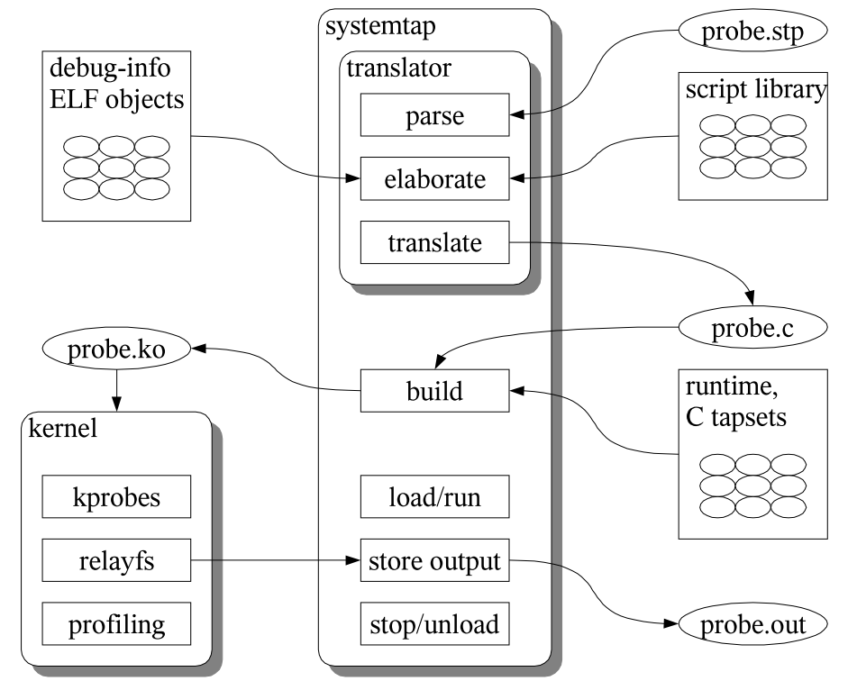

# 什么是systemtap

假如现在有这么一个需求：需要获取正在运行的 Linux 系统的信息，如我想知道系统什么时候发生系统调用，发生的是什么系统调用等这些信息，有什么解决方案呢？

* 最原始的方法是，找到内核系统调用的代码，加上我们需要获得信息的代码、重新编译内核、安装、选择我们新编译的内核重启。这种做法对于内核开发人员简直是梦魇，因为一遍做下来至少得需要1个多小时，不仅破坏了原有内核代码，而且如果换了一个需求又得重新做一遍上面的工作。所以，这种调试内核的方法效率是极其底下的。
* 之后内核引入了一种Kprobe机制，可以用来动态地收集调试和性能信息的工具，是一种非破坏性的工具，用户可以用它跟踪运行中内核任何函数或执行的指令等。相比之前的做法已经有了质的提高了，但Kprobe并没有提供一种易用的框架，用户需要自己去写模块，然后安装，对用户的要求还是蛮高的。
* systemtap 是利用Kprobe 提供的API来实现动态地监控和跟踪运行中的Linux内核的工具，相比Kprobe，systemtap更加简单，提供给用户简单的命令行接口，以及编写内核指令的脚本语言。对于开发人员，systemtap是一款难得的工具。

# systemtap 工作原理
systemtap 的核心思想是定义一个事件（event），以及给出处理该事件的句柄（Handler）。当一个特定的事件发生时，内核运行该处理句柄，就像快速调用一个子函数一样，处理完之后恢复到内核原始状态。这里有两个概念：

* 事件（Event）：systemtap 定义了很多种事件，例如进入或退出某个内核函数、定时器时间到、整个systemtap会话启动或退出等等。
* 句柄（Handler）：就是一些脚本语句，描述了当事件发生时要完成的工作，通常是从事件的上下文提取数据，将它们存入内部变量中，或者打印出来。
Systemtap 工作原理是通过将脚本语句翻译成C语句，编译成内核模块。模块加载之后，将所有探测的事件以钩子的方式挂到内核上，当任何处理器上的某个事件发生时，相应钩子上句柄就会被执行。最后，当systemtap会话结束之后，钩子从内核上取下，移除模块。整个过程用一个命令 stap 就可以完成。 上面只是简单的原理，更多背后的机理参考网上资料和相应的论文。



yum -y install systemtap

测试:
stap -ve 'probe begin { log("hello systemtap!") exit() }'

```
#!/usr/bin/stap

probe begin 
{
    log("begin to probe")
}

probe syscall.open
{
    printf ("%s(%d) open (%s)\n", execname(), pid(), argstr)
}

probe timer.ms(4000) # after 4 seconds
{
    exit ()
}

probe end
{
    log("end to probe")
}
```

[进阶](https://www.ibm.com/developerworks/cn/linux/l-systemtap/index.html)

